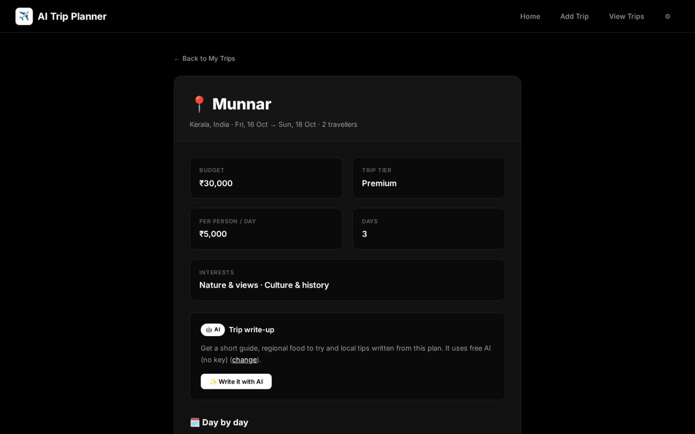
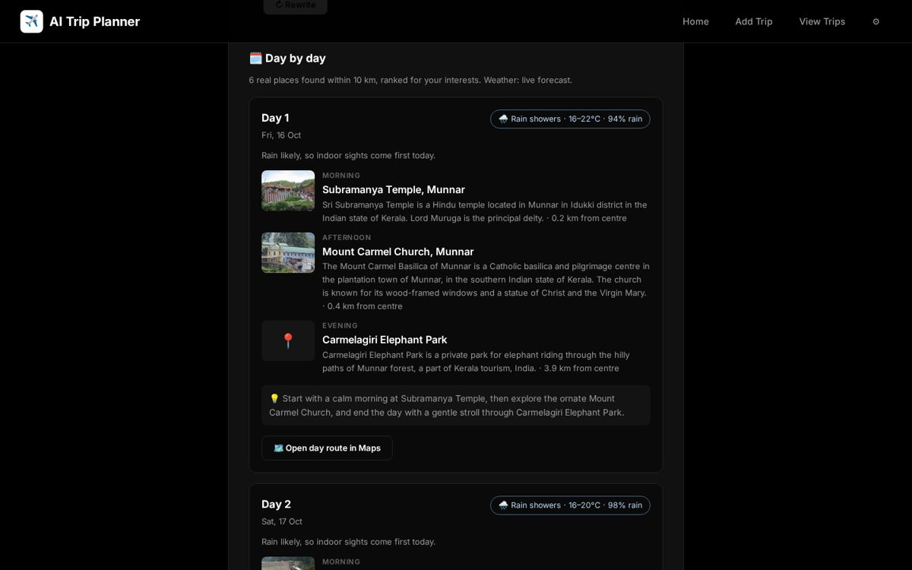
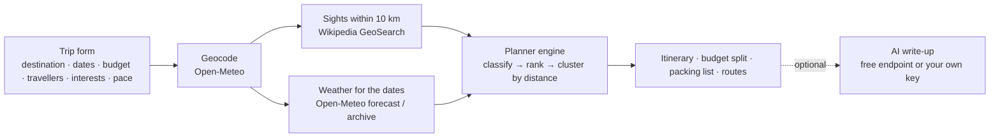

# ✈️ AI Trip Planner

**Live demo → https://shivesh900.github.io/genaitripplanner/**

Plan a trip in under a minute: enter where, when, how many people and your budget, and
get a **day-by-day itinerary built from real places and real weather**, a budget split,
a packing list and Google Maps routes. Add an optional **AI write-up** (overview, food to
try, local tips) with one tap. **No API key or paid service is needed** for the planner.





## How it works



1. **Places** – every Wikipedia article with coordinates within 10 km of the destination
   is fetched, then classified (culture, nature, spiritual, food, beaches, adventure).
   Villages, stations, schools, administrative areas and the like are filtered out.
2. **Ranking** – places score higher when they match your interests, have a photo and a
   description, and are close to the centre.
3. **Itinerary** – each day starts from the best remaining place and adds its nearest
   neighbours (greedy clustering), so you are not zig-zagging across town. Markets and
   beaches go to evenings; on a **rainy day** (forecast ≥ 60 % rain) indoor sights come
   first. If there aren't enough real sights, the slot says "free time" instead of
   inventing one.
4. **Weather** – live forecast when your trip is within 16 days, otherwise the same dates
   last year from the historical archive (labelled as such).
5. **Budget** – the four tiers from v1 (Budget / Standard / Premium / Luxury), now based on
   spend **per person per day**, with a split into stay, food, local transport,
   activities and buffer, plus room-per-night and food-per-day estimates.
6. **AI write-up (optional)** – the plan is sent as a grounded prompt ("use ONLY these
   stops") to a free keyless endpoint, or to **Gemini / any OpenAI-compatible API with your
   own key**. The key is stored only in your browser and sent only to that provider; it is
   never in this repo.

## Tech stack

React 19 · Vite · React Router (hash routing for static hosting) · Open-Meteo API ·
Wikipedia API · OpenStreetMap embed · Node.js + Express + MongoDB (optional backend) ·
`node:test` · GitHub Actions → GitHub Pages.

## Run locally

```bash
cd ai-trip-planner/frontend
npm install
npm run dev        # http://localhost:5173 – trips are saved in the browser
npm test           # planner engine tests
```

Optional backend (Express + MongoDB, falls back to an in-memory store when
`MONGODB_URI` is not set):

```bash
cd ai-trip-planner/backend
npm install
MONGODB_URI="mongodb+srv://…" npm start     # http://localhost:5000
npm test
```

Build the frontend with `VITE_API_URL=http://localhost:5000` to store trips on the
server instead of in the browser.

| API | |
|---|---|
| `GET /api/test` | health + storage mode |
| `POST /api/trips` | create a trip (validated) |
| `GET /api/trips`, `GET /api/trips/:id` | list / read |
| `PATCH /api/trips/:id` | save the generated plan or AI write-up |
| `DELETE /api/trips/:id` | delete |

## What changed from v1

v1's live site loaded, but every save failed with
`Cannot connect to local MongoDB in Vercel` (no database was configured), the backend's
`npm start` pointed at a `server.js` that didn't exist, and the "AI suggestion" was one of
four fixed paragraphs chosen by budget. v2 keeps the same React + Express design and
look, and adds the real planner engine, browser storage (works on static hosting), a
working optional backend with tests, and CI that deploys to GitHub Pages.

## Credits

Places and summaries from Wikipedia (CC BY-SA), weather and geocoding from Open-Meteo,
map © OpenStreetMap contributors.

Built by **Shivesh Haran P** – [github.com/shivesh900](https://github.com/shivesh900)
